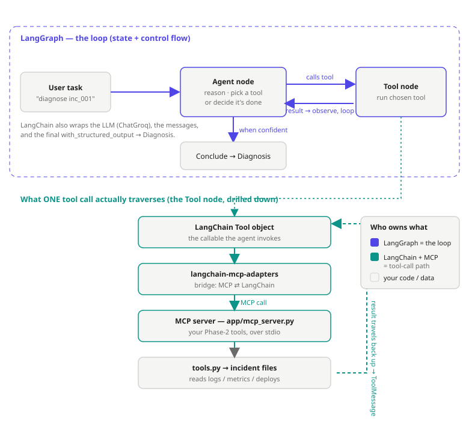

https://github.com/user-attachments/assets/10a2e6d5-7144-4cc4-9788-0b3f0361ade4


# Ops Copilot

Agentic incident-diagnosis assistant. Give it an alert or error; it runs a
reason → act → observe → reflect loop over system telemetry (logs, metrics,
deploys) and returns a probable root cause with cited evidence and a suggested
fix.

> **Status:** Phase 6 — deployed (FastAPI service, Docker, CI/CD, live demo).

## Tech
FastAPI · LangGraph · LangChain · LangSmith · MCP · Docker · CI/CD · MLflow

_(The block at the very top is Hugging Face Space config — it tells HF to build the
Dockerfile and serve on port 7860. GitHub renders it as a small YAML header.)_

## Architecture
LangGraph owns the reason-act loop; LangChain provides the model/tool/message
abstractions; MCP is the hop from a tool object down to the telemetry server.



## Quickstart
```bash
# 1. Install deps (uv creates a virtual env automatically)
uv sync

# 2. Run the tests
uv run pytest -v

# 3. Run the API
uv run uvicorn app.main:app --reload
# open http://localhost:8000/health  and  http://localhost:8000/docs

# 4. (optional) Run in Docker
docker compose up --build
```

## LangSmith trace
```bash
cp .env.example .env   # then add your LANGSMITH_API_KEY
uv run python scripts/hello_langsmith.py
# check https://smith.langchain.com -> project "ops-copilot"
```

## Layout
```
app/main.py              FastAPI app (/health)
tests/test_health.py     health endpoint test
scripts/hello_langsmith.py   minimal LangSmith trace
Dockerfile, docker-compose.yml
pyproject.toml           deps + ruff + pytest config
```

## Incident dataset (Phase 1)
```bash
uv run python data/generate_incidents.py   # writes 24 labeled incidents to data/incidents/
uv run python app/incidents.py             # prints a summary of them
```
Each incident folder has `logs.jsonl`, `metrics.json`, `deploys.json`, and a
`label.yaml` (the ground-truth root cause). 6 failure classes, 18 train / 6 test.

## Evaluation (Phase 4)
```bash
uv run python evaluation/run_eval.py --diagnoser single_shot  # one-prompt LLM
uv run python evaluation/run_eval.py --diagnoser agent        # the agentic loop
uv run python evaluation/run_eval.py --chart                  # docs/eval_results.png
```
Ablation on the held-out test set: does the agentic loop beat a single-shot LLM?
(accuracy, macro-F1, confusion).

## Run the service
```bash
uv run uvicorn app.main:app --reload   # http://localhost:8000  (demo page + /docs)
docker build -t ops-copilot . && docker run -p 7860:7860 --env-file .env ops-copilot
```
`POST /diagnose {"incident_id": "inc_001"}` runs the agent and returns a Diagnosis.

## Roadmap
- [x] Phase 0 — skeleton
- [x] Phase 1 — labeled incident dataset
- [x] Phase 2 — MCP tool servers (logs, metrics)
- [x] Phase 3 — LangGraph agentic loop
- [x] Phase 4 — eval: single-shot vs agent ablation
- [x] Phase 5 — MLflow experiment tracking
- [x] Phase 6 — deploy (Docker + CI/CD + live demo)
